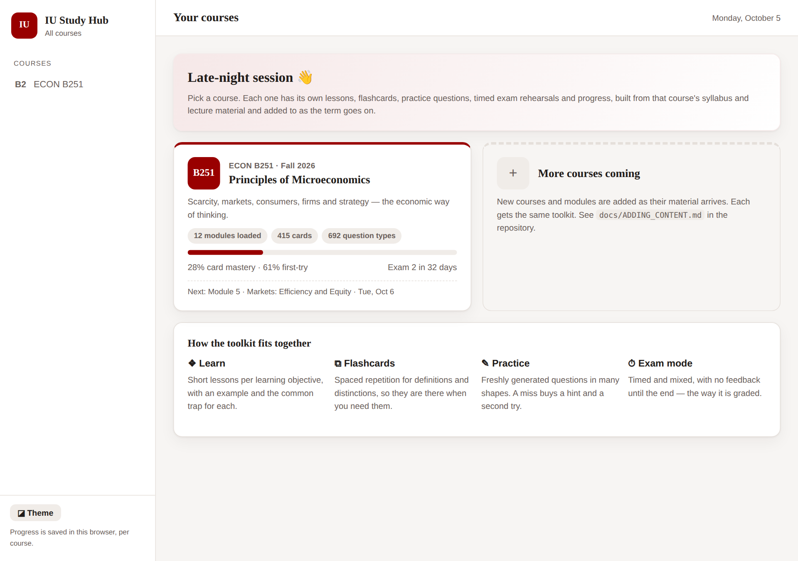
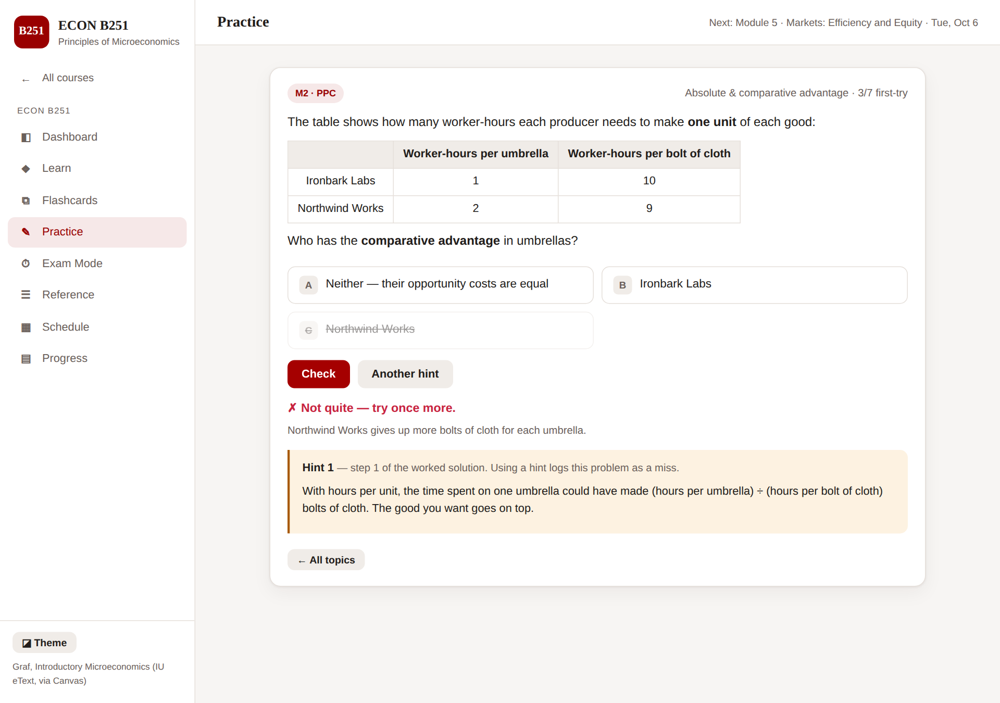
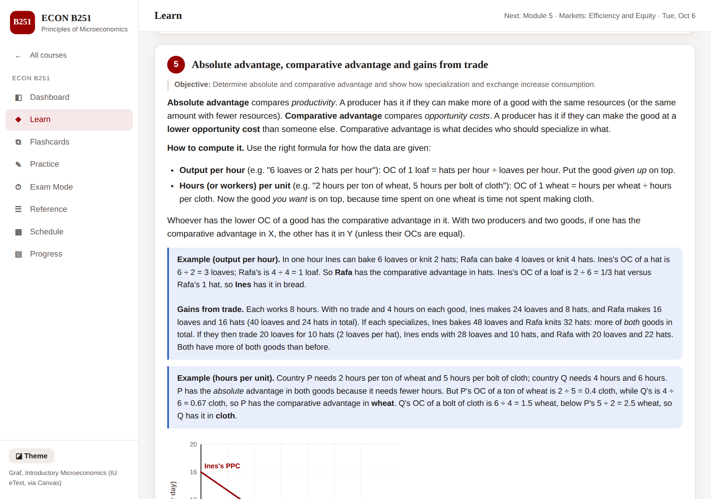
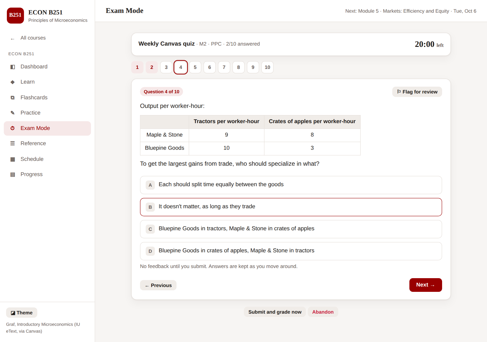
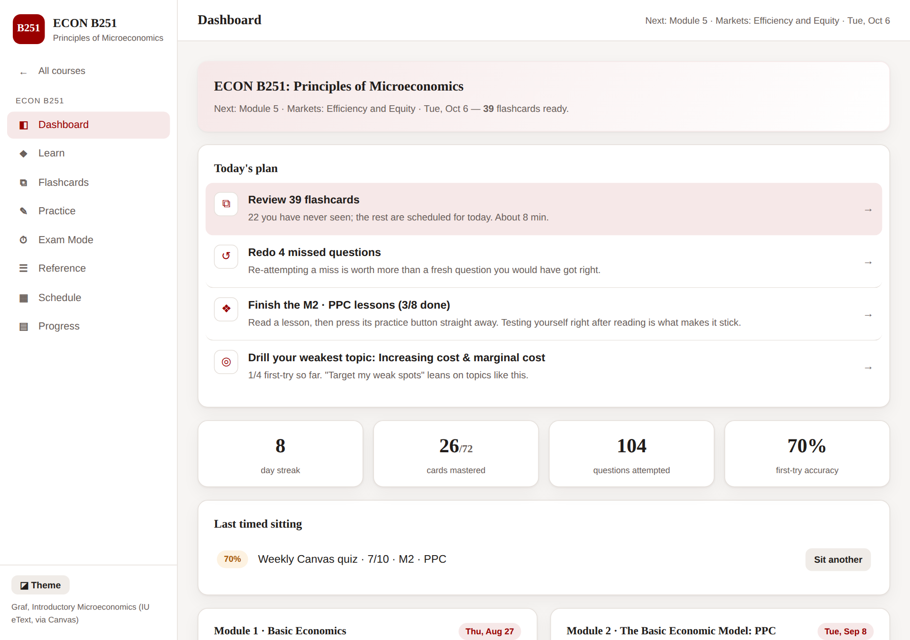

# IU Study Hub

An interactive study companion for Indiana University coursework, organised by course and built as a fast, dependency-free static site on GitHub Pages. Each course's syllabus and lecture material is turned into **short concept lessons**, **spaced-repetition flashcards**, **freshly generated practice questions with worked solutions**, **timed exam rehearsals**, and a **dashboard that tells you what to study next**. New modules are added as the term goes on.

It is modelled on the [MATH 340 Probability Studio](https://github.com/izenstae/Math-340-Probability-Study-tool-) and generalised to many courses and many question formats.

**Live site:** https://izenstae.github.io/IUCourseWork/



## Courses

| Course | Term | Units loaded | Cards | Topics | Question types |
| --- | --- | --- | ---: | ---: | ---: |
| **ECON B251** · Principles of Microeconomics (J. Chen) | Fall 2026 | Module 1 · Basic Economics, Module 2 · The PPC | 72 | 15 | 111 |
| *More courses* | | Added as material is provided | | | |

### ECON B251 content

| Module | Lessons | Cards | Topics | Question types | Status |
| --- | ---: | ---: | ---: | ---: | --- |
| Module 1 · Basic Economics — scarcity, micro vs. macro, rationality & self-interest, opportunity cost, marginal analysis & incentives, positive vs. normative, models & ceteris paribus | 7 | 34 | 7 | 50 | ✅ Available |
| Module 2 · The Basic Economic Model: PPC — factors of production, reading a PPC, increasing cost, MB/MC & allocative efficiency, absolute & comparative advantage, gains from trade, growth & the per-worker production function, Rule of 70 | 8 | 38 | 8 | 61 | ✅ Available |
| Modules 3–12 (demand & supply, elasticity, efficiency, price controls & taxes, market failures, consumer optimum, costs, perfect competition, monopoly, oligopoly & game theory) | | | | | 🔜 Added as covered in class |

The course's schedule, Friday quiz and Saturday Q&A due dates, exam dates (Exam 1 Oct 1, Exam 2 Nov 5, final Dec 17), and grade weights come from the syllabus. Exam-mode presets match the real assessments.

## What's in each course

**▶ Daily mix: the one session to do every day.** About 10 interleaved questions (≈15 min), assembled from what the research on durable learning says matters:

- **spaced retrieval for every practice topic, not just flashcards.** A topic answered correctly *n* times in a row comes back after 1, 3, 7, 16 and then 35 days. A miss resets it.
- **a forgetting model.** Each topic's estimated retention decays with time since it was last practised, faster for topics you know less well. Slipping topics are pulled into the mix before a cumulative exam exposes them.
- **delayed redo of misses.** A missed question waits at least 6 hours before it is offered again. Getting it right after a gap is real learning, not short-term memory.
- **an immediate transfer check.** After any miss, a *fresh question of the same type* with new numbers and wording comes back a few questions later, so you know whether the idea has clicked.
- **interleaving across all modules covered so far**, with the topic hidden until you answer.

The dashboard leads with the daily mix. Each topic on the Practice page shows its schedule: *new*, *review due*, *next review in 3d*, or *mastered*.

**❖ Learn: concept lessons.** One short lesson per learning objective, written in plain language. Each has a *key idea*, a fresh worked *example* and the *common trap* students fall into. Every lesson ends with buttons that drop you straight into practice on that concept, because testing yourself right after reading is what makes it stick. Mark lessons done and the dashboard tracks what is left.

**⧉ Flashcards with spaced repetition.** Every definition, distinction and principle is a card. Many ask for an example or a *why*, not just a definition. A six-box Leitner system schedules reviews. Cards you miss come back later *in the same session*. A **cram** mode leads with your weakest cards the night before a quiz. Keyboard: Space flips, 1 = missed, 2 = got it.

**✎ Practice that teaches concepts, not question formats.** Each topic is a *family of structurally different questions*, not one template with the numbers shuffled. A topic cycles through all of its question types before any repeats. Names, numbers, goods and scenarios are regenerated every time, and statements are dealt from large banks, so you cannot get by on remembering an answer. The same idea comes at you from several directions:

- **recognise** it (which example shows comparative advantage?), **apply** it (compute the opportunity cost), **reverse** it (what must the next-best alternative have been?), **predict** with it (what happens to the PPC if…?), and **explain** it
- in **different representations**: tables, graphs (inline, theme-aware SVG), word problems and statements to sort
- with **edge cases that punish autopilot**: a positive statement that is false, a giant firm that is still micro, a producer with an absolute advantage in both goods, "free" things that still have an opportunity cost

Questions use the **same formats as the exams**: multiple choice, drop-down sorting, select-all, fill-in numerical and graph reading. The practice session is built around *learning from mistakes*:

- **The topic is hidden** in mixed sessions until you answer. Spotting which idea is being tested is half the battle.
- **A wrong answer buys a hint and a second attempt**, not the answer. For multiple choice, it also explains the misconception behind the option you picked and strikes that option out.
- **Every wrong option has an explanation**, listed option by option with the worked solution.
- **Only unaided first attempts count** in your stats.
- **Target my weak spots** samples topics by how badly you are doing at them. **Which concept? drill** shows a question and asks only which idea it tests.
- **Misses are kept** in a redo queue with their solutions. Solving one there clears it.

**⏱ Exam mode.** Timed, mixed, deferred-feedback sets sized from the syllabus: a 10-question weekly quiz on the latest module, 75-minute Exam 1 / Exam 2 rehearsals (Exam 2 weighted toward Modules 5–8 but cumulative), a 2-hour cumulative final, and custom sets. No hints and no topic labels; a question palette with flag-for-review. Afterwards: score, where the points went, every worked solution, and every miss pushed into your stats and redo queue. Presets fill in automatically as modules are added.

**☰ Reference & study sheet.** Every card on one searchable page, plus each module's **"spotting the concept"** table: *when the question says…, think…, because…*. Tick entries and print a compact two-column study sheet.

**◧ Dashboard and ▤ Progress.** A ranked "today's plan" (unread lessons, the daily mix, due cards, quiz due in ≤3 days, exam in ≤14 days), per-module mastery, per-topic and per-question-type accuracy, timed-sitting history, a 4-week activity strip, a streak, and export/import of progress.

| Practice: a miss buys a hint and a second try | Learn: lessons with examples and traps |
| --- | --- |
|  |  |
| **Exam mode**: timed, feedback at the end | **Dashboard**: what to do next |
|  |  |

## Using the site

There is no build step, no server and no account.

- **GitHub Pages:** the `Deploy to GitHub Pages` workflow publishes the repository root on every push to `main`, after re-running the content checks. The first time, set **Settings → Pages → Build and deployment → Source** to **GitHub Actions** if it is not already. The site lives at `https://izenstae.github.io/IUCourseWork/`.
- **Locally:** open `index.html` in a browser, or run `python3 -m http.server` and visit `http://localhost:8000`.

KaTeX is vendored in `lib/katex/`, so math renders offline.

## Adding material as the term goes on

Each course is a folder in `courses/`, and each module is one self-registering file. Adding a module means creating one file and adding one `<script>` line to `index.html`; no application code changes. Adding a course means creating its `course.js` from the syllabus. The full recipe is in [`docs/ADDING_CONTENT.md`](docs/ADDING_CONTENT.md).

The quickest route is to upload the new slides, notes or syllabus to Claude and say: *"Add this to the IU Study Hub following docs/ADDING_CONTENT.md."*

## Checks

Plain Node, no dependencies. The `Checks` workflow runs the first three on every push and pull request, and the deploy re-runs them before publishing:

```sh
node tools/check-content.js 1000   # every generator in every course, 1000x: well-posed questions, valid answers,
                                   # no duplicate choices, balanced HTML, every declared question type appears
node tools/check-app.js            # grading for every question kind, misconception diagnosis, per-course store,
                                   # Leitner ladder, weakness model, redo queue, schedule, exam builder, and that
                                   # every generated question accepts its own answer
node tools/audit-learning.js       # learning-quality bar per unit: lessons with key idea/example/trap, every topic
                                   # linked from a lesson, ≥5 question types per topic, explained wrong options, hint ladders
node tools/check-browser.js        # (local, needs Playwright) drives every view of every course in headless Chromium
                                   # at desktop and phone widths, light and dark; fails on any page/console error
```

## Project structure

```
├── index.html                 # App shell — one <script> per course file
├── css/styles.css             # Theme (light/dark, per-course accent), layout, components, print sheet
├── js/
│   ├── core.js                # STUDY registry, utilities, question builders (mc/tf/multi/classify/num), SVG graphs
│   ├── store.js               # Per-course localStorage progress, Leitner, weakness model, redo queue
│   ├── answers.js             # Render / read / grade / diagnose every question kind (shared by practice & exams)
│   ├── practice.js            # Practice sessions, hints & second attempts, redo queue, "Which concept?" drill
│   ├── flashcards.js          # Leitner review and cram sessions
│   ├── exam.js                # Timed deferred-feedback sittings + report
│   └── app.js                 # Router, course hub, dashboard, learn, reference, schedule, progress
├── courses/
│   └── econ-b251/
│       ├── course.js          # Syllabus facts: schedule, key dates, grade weights, exam presets
│       ├── m1.js              # Module 1 · Basic Economics
│       └── m2.js              # Module 2 · The Basic Economic Model: PPC
├── lib/katex/                 # Vendored KaTeX
├── tools/                     # check-content.js, check-app.js, check-browser.js, screenshots.js
├── docs/ADDING_CONTENT.md     # How to add a module or a course
└── .github/workflows/         # checks.yml (CI) and deploy-pages.yml (GitHub Pages)
```

## Privacy and course materials

All progress stays in your browser's `localStorage`. Nothing is sent anywhere.

The lessons, cards and questions are **original study material written to the courses' learning objectives**. Instructors' slides, handouts and syllabi are not reproduced here, because course policies (including B251's) forbid redistributing them. This is a personal study aid, not an official course resource, and it is meant for learning the material, not for completing graded work.
